# Visualizing metabolomics data with R

This repository holds R code and plots supporting _Berker et al. (2022) NMR Biomed_, <https://doi.org/10.1002/nbm.4865>.

Find the plot source files to modify in [`R/source`](R/source), output plot files in [`R/output`](R/output/), and the manuscript file in [`TeX/output/manuscript.pdf`](TeX/output/manuscript.pdf).

## Prerequisites

To clone the repository and regenerate the plots, you will need Git ([git-scm.com](https://git-scm.com/)) and R ([r-project.org](https://www.r-project.org/), at least v4.1.0).

On Windows, don't forget to add R's binary directory - e.g., `C:\Program Files\R\R-4.2.1\bin\x64` -  to the `PATH` environment variable: type "Edit environment variables for your account" in the Start menu and append that folder to the `PATH` user variable, or compare instructions at [stackoverflow.com](https://stackoverflow.com/a/44272417). When successful, you should be able to launch R from any terminal or the "Run" command simply by typing `R`:

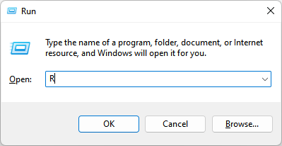

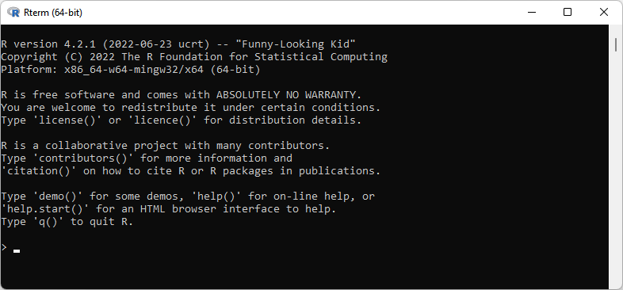

On Linux, you may need to install additional system dependencies. On Ubuntu 22.04, use

```shell
sudo apt install cmake libcurl4-openssl-dev libudunits2-dev libxml2-dev
```

In both cases, you should install at least one package in interactive mode to make sure there is a user-writable library location to install required packages to, e.g., running (within `R`)

```R
install.packages("ggplot2")
```

To also rebuild the manuscript, you will need a LaTeX distribution with `latexmk` installed (e.g., TeX Live, [tug.org](https://www.tug.org/texlive/), or MiKTeX, [miktex.org](https://miktex.org/)).

All operations can be run using [the command line](#using-the-command-line) or [Visual Studio Code](#using-visual-studio-code) (download at [code.visualstudio.com](https://code.visualstudio.com/)).

## Using the command line

```shell
git clone https://github.com/yannickberker/met-vis-R
cd met-vis-R
Rscript R/plots.R
latexmk TeX/manuscript.tex
```

## Using Visual Studio Code

In Visual Studio Code, after checking out the repository and opening the folder, you can also run the "Generate Plots" task, followed by the `latexmk` LaTeX Workshop recipe. Feel free to follow the sequence of screenshots below:

1. Hit `F1`, type `clone`, and select "Git: Clone"

   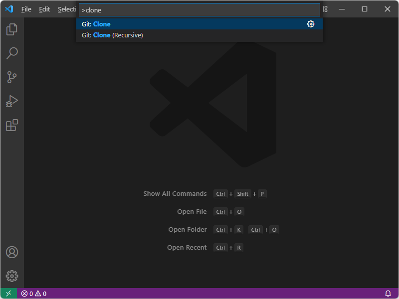

1. Paste "https://github.com/yannickberker/met-vis-R"

   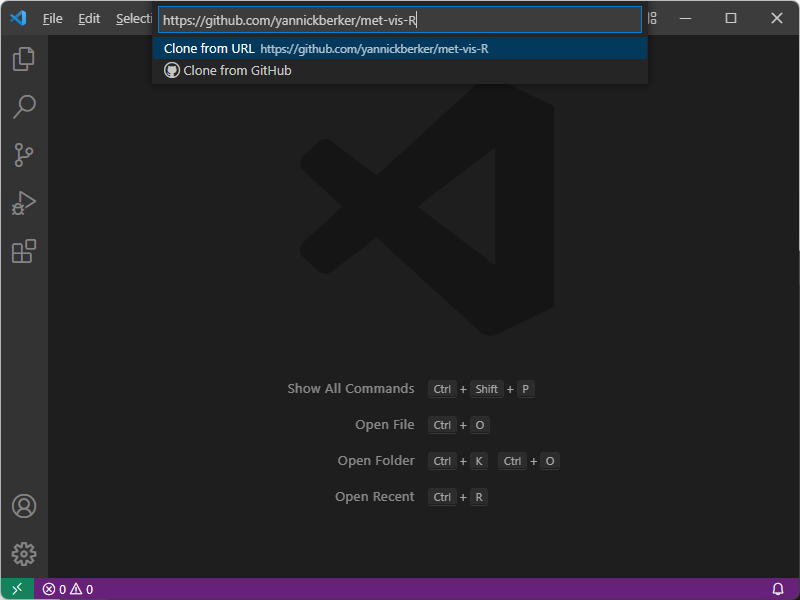

1. Select location of a new folder to clone the repository to

   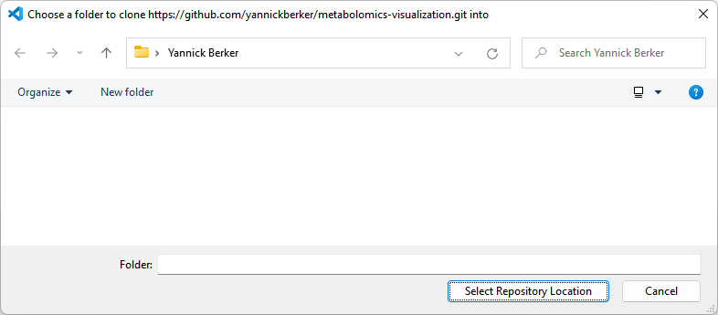

1. Wait for repository to be cloned, then open the cloned repository

   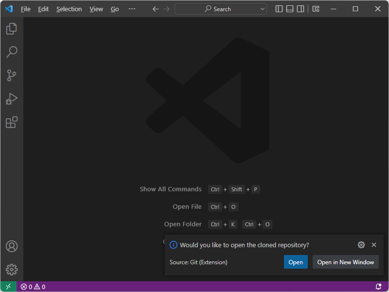

1. Install recommended extensions when prompted (there is no need to install any _optional_ dependencies such as radian)

   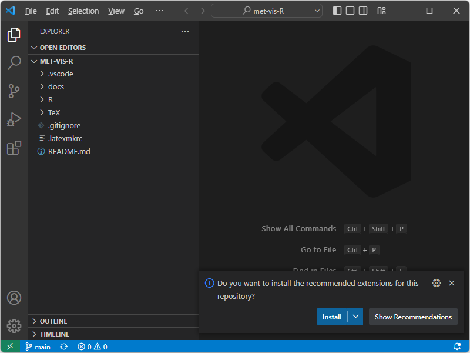

1. Press `Ctrl+P`, enter `bars` and select `bars.R`

   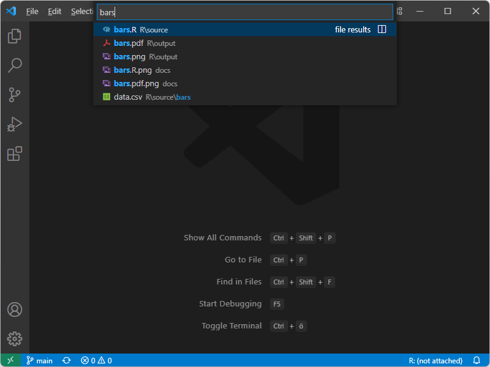

1. Modify the code as desired

   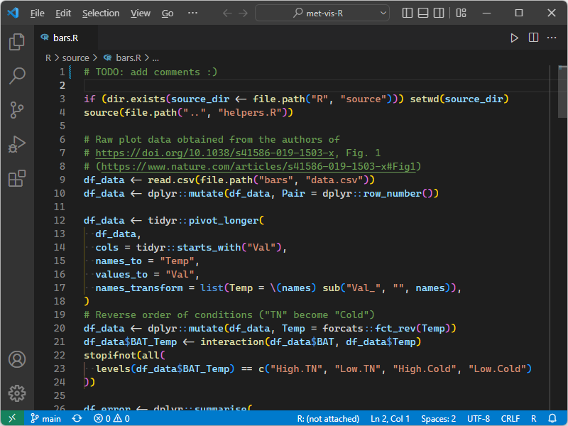

1. Hit `F1`, type `run task`, and select "Task: Run Task"

   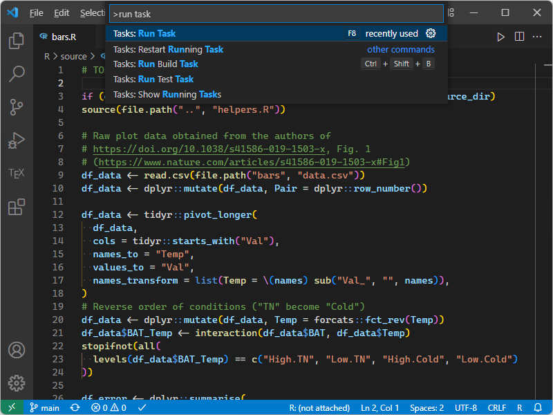

1. Select `Generate plots` (use `Show All Tasks...` if it is not shown right away)

   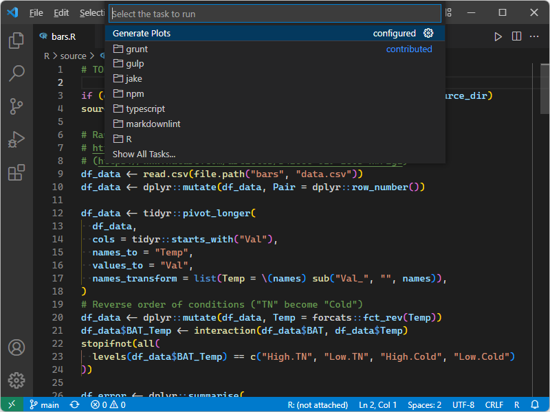

1. Wait for task to finish

   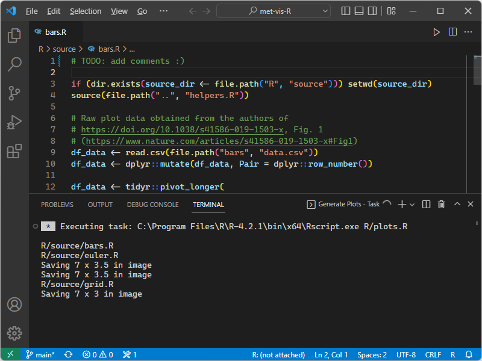

1. Press `Ctrl+P`, enter `bars` and select `bars.pdf`

   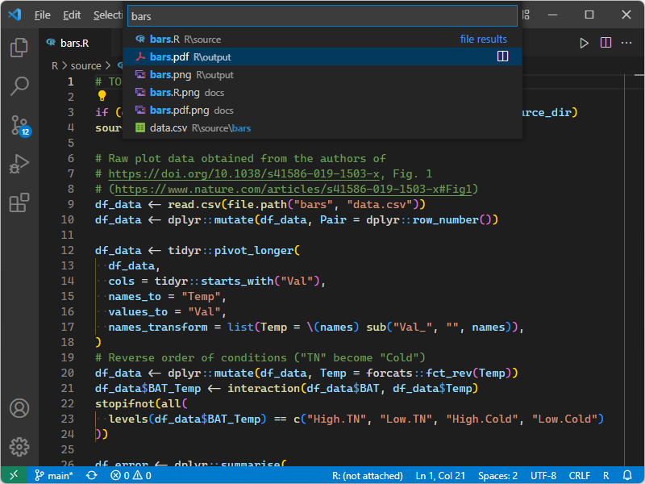

1. Voilà, your bar plot!

   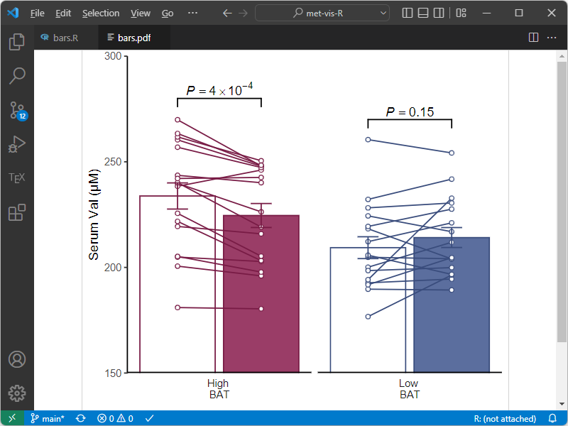
